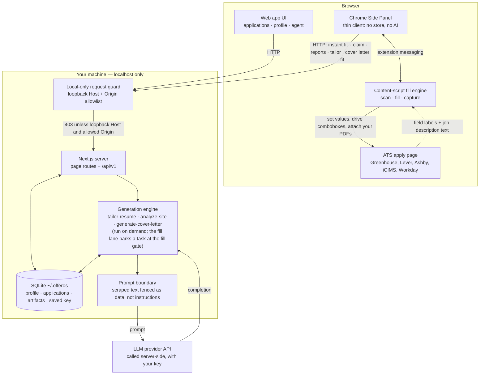

# OfferOS

[](https://github.com/averatec0773/offeros/actions/workflows/ci.yml)
[](LICENSE)


Local-first, open-source **AI job-application agent**. Most AI job tools stop
being intelligent the moment you hit Apply; OfferOS is built around an agent
whose work _starts_ there — it knows where every application stands, reads the
per-field record of every form fill, answers _"which of these are stuck, and
why?"_ with the evidence attached, and makes small, gated changes when you ask.
Around the agent: `apps/web` (Next.js) owns your data in a local SQLite
database and runs all the AI; `apps/extension` (a Chrome **Side Panel**) is the
agent's **execution arm** — it fills real ATS forms from your profile and
reports every field back. **Submitting is yours** — OfferOS stops at the submit
button and waits for you.

## How it works

1. Build your profile once in the web app (upload a résumé to auto-fill it),
   then add jobs by **pasting the link**. On a supported job board OfferOS
   reads the title, company and description itself, and checks what the form
   will ask.
2. Each application gets a page of its own: what it asks and how much of it you
   can already answer, plus a tailored résumé and cover letter on demand —
   grounded in your own facts, server-side, with your own LLM key.
3. To apply, either lane works: the application page hands the extension a
   **fill task**, or on any supported apply page **"Fill this page with my
   profile"** creates the application and fills in one click. The panel reports
   each field's status live as it lands.
4. Still in the panel: check the fit score, tailor and attach the résumé and
   cover letter (inline PDF previews), let the AI draft answers to open
   questions, then **review the page, submit it yourself**, and mark it applied.
5. Afterwards, ask the agent: _"which of these are stuck, and why?"_ — it reads
   the fill reports and answers with the evidence attached.

The AI runs in the web app, server-side, with your key. The extension is a thin
client — no local database, no LLM calls of its own.

## The agent

Talk to it on `/agent` (about all your applications) or inside any single one.
It works in a loop of small verified steps: **look first** — fill reports,
decision traces, your saved answers, form memory — then answer. Every answer
arrives with the steps that produced it, shown rather than hidden, so you can
see exactly which records it read before trusting what it says.

It can also **do** things: save an answer to your bank, update an application,
tailor a résumé, generate a cover letter. Three rules keep that safe:

- **At most two changes per turn** — it looks freely, but acting is rationed.
- **Every write verifies itself** by re-reading what it wrote, and lands in the
  same trace you see in chat — the transcript and the audit log are one thing.
- **Gates live inside the tools, not in the prompt.** The tool that marks an
  application submitted refuses unless _you_ said you submitted it — no
  phrasing, and no text scraped from a web page, can talk it past that.

What makes its answers specific rather than generic: the extension reports
every field of every fill (what went in, from which source, what failed and
why), failures are grouped by cause in code — not by a model guessing — and
form memory carries what each question shape did across applications.

## Architecture



The guard runs in Next middleware, so it applies to page routes as well as the
API — the extension is just another local client of the same surface.

## Quickstart

**Web app:**

```bash
npm install
npm run dev:web     # http://localhost:3000
```

On first run, open **Settings → AI** to pick a provider and paste your API key —
no restart, no dotfiles. (`apps/web/.env.local` works as an optional fallback;
see `apps/web/.env.example`.) Data lives in SQLite at `~/.offeros/offeros.db`;
no account, no cloud, and your key is only ever sent to the provider you chose.

**Extension** — works on any careers page. **Greenhouse** is validated on real
forms; **Lever · Ashby · iCIMS · Workday** have recipes and are injected
automatically; everywhere else a generic engine reads the form when you open the
panel on it. Chrome will tell you at install that the extension can read and
change data on all sites — it can, because a job posting can be on any site;
what it does with that is in [SECURITY.md](.github/SECURITY.md).

```bash
npm run build -w @offeros/extension   # → apps/extension/.output/chrome-mv3/
```

1. `chrome://extensions` → Developer mode → **Load unpacked** → select
   `apps/extension/.output/chrome-mv3/`.
2. Have the web app running — or run `npm run host:install` once and the
   panel's "Start OfferOS" button boots the local server for you.
3. Open an apply page — any apply page — click the OfferOS toolbar icon, and the
   panel scans the form and offers **"Fill this page with my profile"**. Rows flip to
   a check as each value verifiably lands; click a row to jump to that field,
   hover to see why it chose that value. Sessions survive reloads.

## What's inside

- **Application list** — every job you are tracking, what state it is in, and a
  fit badge per role.
- **Profile & onboarding** — résumé upload → auto-populated profile (education,
  experience, skills, answer bank, EEO presets); multiple résumés, one per
  application.
- **Application record** — one page per job: what has happened to it (fills,
  revisions, checks), what its form asks and which questions you
  cannot yet answer, and the résumé and cover letter to send — generate,
  revise with real diffs, accept.
- **Job reconnaissance** — one click asks whether the posting is still up and,
  on a supported board, what its form will ask. Deterministic: status codes and
  the platform's own API, no model, and "could not tell" when that is the
  truth.
- **Answer guards** — voluntary self-identification and legally-consequential
  questions (work authorization, sponsorship) are never answered automatically;
  policy acknowledgments are filled but surfaced with their wording afterwards.
- **Fit analysis, cover-letter templates, PDF export, Prompt Studio, style
  memory** — advisory fit scoring; your own `.tex` template or the built-in
  one; per-task prompt/model overrides; approved tweaks teach a style note
  (tone only, never facts).
- **Form memory** — every fill outcome is remembered per question shape, so a
  question that broke once is recognized the next time it appears.
- **Undo on the one-way door** — a mis-clicked "mark as submitted" restores the
  task from the append-only event log.

## Two design choices

**Ask the page, don't guess.** Most autofill infers a field's meaning from its
visible label — and that inference is where fills die. Major ATS pages already
carry a machine-readable description of each field (React props, semantic ids);
reading it turns classification into a lookup. Measured across six live forms:
question text went from **37.5% correct to 100%**, and 157 raw controls
collapsed into 81 real questions. It's a safety property too: the guards that
refuse to auto-answer work-authorization questions match on question text, and
a blank label matches nothing. Heuristics remain as the fallback for pages that
expose nothing. — `packages/autofill/src/field-meta.ts`

**The agent explains; the engine executes.** Generating a document is a
deterministic, grounded step with no reasoning loop inside it. The agent sits above: triaging, diagnosing, answering questions,
making small gated changes. Failure grouping is done in code, not in a prompt
(which rows share a cause has an exact answer); every tool call is verified and
written to a trace, so the steps you see in chat and the ledger a developer
reads are the same events. — `packages/autofill/src/diagnose.ts`,
`apps/web/src/server/agent/`

## Privacy & safety — how it behaves today

- **Submitting is yours** — the submit click happens on the page, by you.
  (Settings → Agent carries an opt-in auto-submit preference that is **not
  wired to anything yet**; both it and this line say so until that changes.)
- **Attaches only your own OfferOS-managed files**; never reads files from the
  page; field classification and filling run on-device, no page HTML uploaded.
- **Keys stay server-side** — the extension never sees your LLM key.
- **Local-first** — all data on your machine, in SQLite.

These describe the current implementation (pinned by tests), stated here so
changes are visible in this file's history. The full security model and how to
report an issue privately: [SECURITY.md](.github/SECURITY.md).

## Development

```bash
npm run dev:web     # web app dev server → http://localhost:3000
npm run dev         # extension dev build with HMR (separate browser)
npm run typecheck   # web + packages + extension type-check
npm test            # root Vitest (packages + apps/web) + extension Vitest
npm run e2e -w @offeros/extension   # headed E2E: real Chromium, built extension
```

Requires Node 24+. npm-workspaces monorepo: `apps/web` (the product),
`apps/extension` (the fill arm), `packages/*` — `core` (domain schemas), `llm`
(IO-free LLM layer), `autofill` (pure DOM-free fill engine shared by both
apps), `pdf` (PDF text extraction). Rebuilding the extension auto-reloads a
loaded unpacked copy within ~2s. Contributions: [CONTRIBUTING.md](.github/CONTRIBUTING.md).

## License

Apache-2.0.
