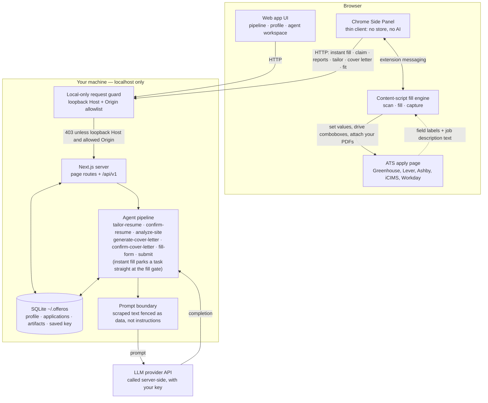

# OfferOS

Local-first, open-source AI job-application copilot for the North American
market. `apps/web` (Next.js) is **the product**: it owns your data in a local
SQLite database and is where you build your profile, track applications, and run
the AI workspace. `apps/extension` (a Chrome **Side Panel**) is the **fill arm**:
on a supported ATS page it fills the form from your profile, tailors your
résumé and writes a cover letter in place (generation runs server-side in the
web app), and reports every field back to the workspace. Submitting is always
a manual action you take on the page. As currently built, field classification
runs on-device, no page HTML is uploaded anywhere, and the only files attached
to a form are your own OfferOS-managed ones — it never reads files from the
page.

Status: pre-alpha.

## How it works

1. In the web app, you build your profile once (upload a résumé to auto-fill it)
   and add jobs you want to apply to.
2. Working an application in the agent workspace tailors your résumé, drafts a
   cover letter, and analyzes fit against the posting — all grounded in your own
   facts, with your own LLM key, server-side.
3. When you're ready to apply, either lane works: the workspace hands the
   extension a **fill task**, or you skip the detour entirely — on any
   supported apply page, **"Fill this page with my profile"** creates the
   application, claims a task, and fills in one click. Either way the panel
   reports each field's status back to the workspace as it lands.
4. Still in the panel: check the fit score, tailor the résumé and write the
   cover letter (with inline PDF previews) and attach them, let the AI draft
   answers to open questions, then **review the page and submit it yourself**
   and mark it applied.

The AI runs in the web app (server-side, with your key). The extension is a
thin client — no local database, no LLM calls of its own — the panel asks the
web app to generate and the content script drives the page.

## Architecture



The guard runs in Next middleware, so it applies to page routes as well as the
API — the extension is just another local client of the same surface.

## Quickstart (web app)

```bash
npm install
npm run dev:web     # http://localhost:3000
```

On first run, open **Settings → AI** in the web app to pick a provider and paste
your API key — that's it, no restart and no dotfiles required. If you'd rather
not paste a key in the UI, `apps/web/.env.local` (`ANTHROPIC_API_KEY` or
`OPENAI_API_KEY`, see `apps/web/.env.example`) works as an optional fallback.
Either way, tune each AI task's model/prompt in **Settings**. Your data is
stored locally in SQLite at `~/.offeros/offeros.db` (override with
`OFFEROS_DB_PATH`), including any key you save in Settings; imported résumé
files live under `~/.offeros/resumes/`. No account, no cloud — everything is on
disk on your machine, and your key is only ever sent to the provider you chose.

## Features (web app)

- **Application pipeline** — a hub of your applications with status tabs, an
  autosaved job description, notes, and a fit badge per role.
- **Profile & onboarding** — upload a résumé to auto-populate your profile
  (personal info, education, experience, skills, an answer bank, and standard
  EEO self-identification), or fill it in by hand. Manage multiple résumés and
  pick one per application.
- **Agent workspace** — a grounded pipeline per application: résumé tailoring →
  JD analysis (with a gaps report) → conditional cover-letter generation, with
  conversational gates and real old-vs-new diffs on every tweak.
- **Fit analysis** — an honest read of what your profile already covers vs. gaps,
  with sub-scores and aligned/missing skills (advisory, never blocking).
- **Cover-letter templates & PDF export** — import your own `.tex` template
  (previewed in-app) or use the built-in one; export a compiled PDF.
- **Prompt Studio** — override each AI task's system prompt and model.
- **Style memory** — approving artifacts you tweaked teaches a per-kind style
  note (tone/structure only, never facts) that future generations honor;
  view/edit/disable it in Settings → Style.
- **Workspace nav** — jump straight into the most recent active application's
  agent workspace.

## One-click autofill (extension)

Supported ATS: **Greenhouse** (validated on real forms) · **Lever · Ashby ·
iCIMS · Workday** (generic fill engine + per-site routing; hardening ongoing).

The extension is a WXT + React + TypeScript MV3 **Side Panel**. It's a thin client
of the web app's local API — no local store, no AI, no third-party sync.

```bash
npm install
npm run build -w @offeros/extension   # → apps/extension/.output/chrome-mv3/
```

1. Open `chrome://extensions`, enable **Developer mode**, **Load unpacked** →
   select `apps/extension/.output/chrome-mv3/`.
2. Make sure the web app is running (`npm run dev:web`). The side panel talks to
   `http://localhost:3000` by default (editable in the panel).
3. Open a supported application page and click the OfferOS toolbar icon to open
   the **Side Panel**.
4. The panel scans the form into a per-field list and offers **"Fill this page
   with my profile"** — one click creates/reuses the application and fills;
   rows flip to a solid check as each value verifiably lands. From the same
   panel you can check the **fit score**, **tailor the résumé** and **write a
   cover letter** (inline PDF preview, then attach), accept or regenerate AI
   answers to open questions, click any row to jump to that field on the page
   (hover shows why it chose that value), and finally mark the application
   submitted. Fields it couldn't answer are reported honestly back to the
   workspace. Sessions survive reloads — a re-opened panel re-claims its task
   and picks up where it left off.

## Engineering highlights

- **IO-free domain packages.** `core`, `llm`, and `autofill` carry no runtime
  dependency but zod and no `node:` or DOM imports, so the fill engine both apps
  share is pure functions over field descriptors — `packages/autofill/src/fill-plan.ts`.
- **Prompt-injection fencing at every scraped-text consumer.** Job-description
  and form-label text is neutralized (so it can't forge a fence) and wrapped as
  data before it reaches a prompt — `packages/llm/src/untrusted.ts`.
- **The API only answers this machine.** A loopback `Host` check on every route
  plus an `Origin` allowlist on mutating methods, in middleware before any
  handler — `apps/web/src/proxy.ts`, `src/server/http/request-guard.ts`.
- **Keys never reach the browser.** The settings API returns a per-provider
  status (`saved` / `env` / `none`) and never a key value, on reads and writes
  alike — `apps/web/src/app/api/v1/settings/llm-keys/route.ts`.
- **Minimal subprocess environments.** PDF rendering spawns `pdflatex` and
  headless Chromium with a hand-built env, never the parent one holding your key
  — `apps/web/src/server/export/{latex-renderer,chromium-pdf}.ts`.
- **Tests run against real substrates.** Route
  tests open a real SQLite file, fill tests drive a real DOM through the actual
  content-script engine, and the fill engine is scored against a 12-résumé ×
  5-form corpus plus a captured real ATS form —
  `packages/autofill/src/__tests__/adaptation/`.
- **Pluggable seams, not branches.** A new PDF output format is one entry in a
  renderer registry (`apps/web/src/server/export/renderers.ts`); style memory is
  a two-method contract behind a registry, so a different store swaps in without
  touching callers (`apps/web/src/server/memory/style-memory.ts`).

## Privacy & safety — how it behaves today

- **Submitting is yours** — nothing in OfferOS clicks submit; you take that
  action on the page (and then mark it applied).
- **Attaches only your own OfferOS-managed files** (the tailored résumé PDF,
  your stored original résumé, or the cover-letter PDF) to file inputs, never
  reads files from the page, and uploads no page HTML anywhere — field
  classification and filling run on-device.
- **Keys stay server-side** — your LLM provider key lives only in the web app's
  environment; the browser extension never sees it.
- **Local-first** — all your data is on your machine, in SQLite.

These describe the current implementation (verified by the test suite), stated
so changes to them are visible in this file's history rather than implied.

## Security model

The trust boundary is your own machine: the server is deliberately
unauthenticated and answers loopback requests only, your provider key stays
server-side, and a template you import runs with your local trust. The full
model — what's in scope, which trade-offs are accepted, and how to report an
issue privately — is in [SECURITY.md](SECURITY.md).

## Development

```bash
npm run dev:web     # web app dev server → http://localhost:3000
npm run dev         # extension dev build with HMR (separate browser)
npm run compile     # extension type-check (tsc --noEmit)
npm run typecheck   # web + packages + extension type-check
npm test            # root Vitest (packages + apps/web) + extension Vitest
npm run test:ext    # extension Vitest only
npm run e2e -w @offeros/extension   # headed E2E: real Chromium, built extension
```

Iterating on the extension against your own Chrome: `npm run build -w
@offeros/extension` stamps the unpacked output, and a loaded unpacked extension
watches its own stamp and reloads itself within ~2s of a rebuild (one manual
reload is needed the first time; open ATS tabs still need a page refresh for
new content-script code).

Requires Node 24+. The repo is an npm-workspaces monorepo: `apps/web` (the
product), `apps/extension` (the Side Panel fill arm), and `packages/*` — `core`
(domain schemas), `llm` (IO-free LLM layer), `autofill` (pure, DOM-free fill
engine, shared by both apps), and `pdf` (PDF text extraction).

## License

Apache-2.0.
